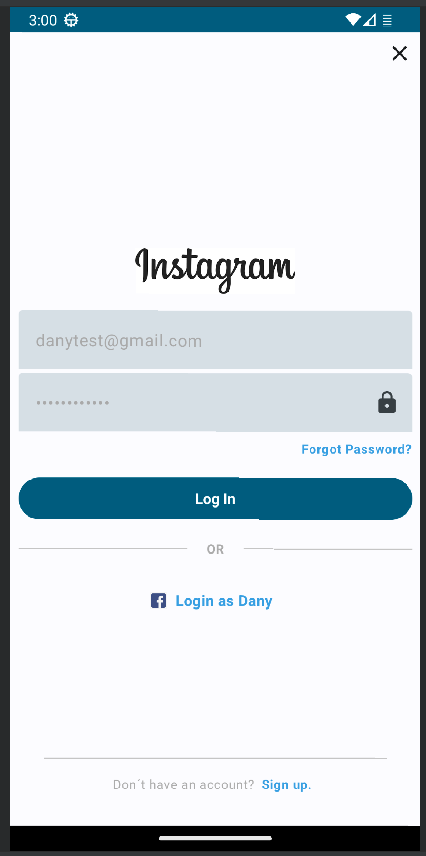

# Android Jetpack Compose Login Instagram

In this project you will see a Instagram Login screen wrote in Jetpack Compose. 
The button will enable when the user writes a correct email and a password with more than 6 chars.

You will find some branches to see how will be the implementation with: 
- Retrofit
- Dependency Injection (Hilt)

## Resources:books:

* [Jetpack Compose Course](https://www.udemy.com/course/jetpack-compose-desde-0-a-profesional/)

## App Demo

---
## Author
* **Daniela Ramirez Gomez** - [danyramirezg](https://github.com/danyramirezg)